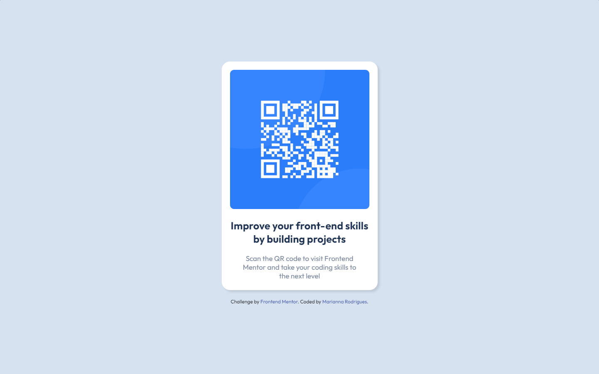

# Frontend Mentor - QR code component solution

This is a solution to the [QR code component challenge on Frontend Mentor](https://www.frontendmentor.io/challenges/qr-code-component-iux_sIO_H). Frontend Mentor challenges help you improve your coding skills by building realistic projects. 

## Table of contents

- [Overview](#overview)
  - [Screenshot](#screenshot)
  - [Links](#links)
- [My process](#my-process)
  - [Built with](#built-with)
  - [What I learned](#what-i-learned)
  - [Continued development](#continued-development)
  - [Useful resources](#useful-resources)
- [Author](#author)


## Overview

### Screenshot

<div align="center">

Desktop



Mobile


</div>


### Links

- Solution URL: (https://www.frontendmentor.io/solutions/qr-code-component-solution-vstOworC3k)
- Live Site URL: (https://mxriannar.github.io/qr-code-component/)

## My process

### Built with

- HTML5
- CSS3
- Flexbox


### What I learned

As a beginner, I have some difficulties with CSS stilization. This is my first Frontend Mentor challenge and I think I managed to do a good job. I didn't need any consultation.


```css
.wrapper {
    background-color: hsl(212, 45%, 89%);
    display: flex;
    flex-direction: column;
    justify-content: center;
    align-items: center;
    height: 100vh;
}

.card {
    background-color: hsl(0, 0%, 100%);
    height: 550px;
    max-width: 360px;
    border-radius: 20px;
    padding: 20px;
    box-shadow: 5px 5px 5px rgba(0, 0, 0, 0.1);
}
```

### Continued development

I would like to continue studying CSS and learn more about it. 

### Useful resources

- I am currently studying frontend at DevQuest course and it has helped me a lot with the flex box part.

## Author

- Frontend Mentor - [@mxriannar](https://www.frontendmentor.io/profile/mxriannar)
- Twitter - [@mxriannar](https://www.twitter.com/mxriannar)

